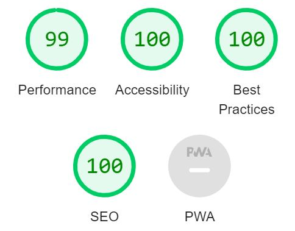

# Online Quiz App

Welcome to the Online Quiz App, an interactive platform for testing and improving knowledge in various fields. This app utilizes the Open Trivia Database (<https://opentdb.com/>) to provide a diverse range of quiz questions. Designed as a school project, it aims to offer an engaging user experience using standard web technologies: HTML, CSS, and JavaScript.

## Table of Contents

- [Online Quiz App](#online-quiz-app)
  - [Table of Contents](#table-of-contents)
  - [UX](#ux)
    - [User Goals](#user-goals)
    - [User Stories](#user-stories)
    - [Developer's Goals](#developers-goals)
- [Design Choices](#design-choices)
  - [Fonts](#fonts)
  - [Icons](#icons)
  - [Colors](#colors)
  - [Structure](#structure)
  - [Wireframes](#wireframes)
    - [Mobile Wireframe](#mobile-wireframe)
    - [Desktop Wireframe](#desktop-wireframe)
- [Features](#features)
  - [Completed Features](#completed-features)
  - [Work-in-Progress Features](#work-in-progress-features)
  - [Planned Features](#planned-features)
  - [Reflections and Challenges Encountered](#reflections-and-challenges-encountered)
  - [Future Improvements](#future-improvements)
- [Technologies Used](#technologies-used)
  - [Languages](#languages)
  - [Tools](#tools)
- [Testing](#testing)
    - [Fixed Bugs](#fixed-bugs)
    - [Unfixed Bugs](#unfixed-bugs)
    - [Manual Testing](#manual-testing)
  - [HTML](#html)
  - [CSS](#css)
  - [Accessibility](#accessibility)
- [Deployment](#deployment)
- [Credits](#credits)
  - [Code Inspiration, Help, and Advice](#code-inspiration-help-and-advice)
  - [Resources](#resources)

[Back to Top](#table-of-contents)

## UX

### User Goals

- Access a wide range of quizzes to test and improve knowledge.
- Enjoy a user-friendly and engaging quiz experience.
- Participate in quizzes across various categories.

### User Stories

- **As a student**, I want to find interesting quizzes to learn and test my knowledge in different subjects.
- **As a teacher**, I seek an educational tool where I can engage my students with diverse quiz topics.
- **As a quiz enthusiast**, I want a platform to challenge myself and compare my scores with others.

### Developer's Goals

- Provide an educational and entertaining quiz platform.
- Ensure a smooth and responsive user experience.
- Integrate a variety of quiz categories and difficulty levels.

[Back to Top](#table-of-contents)

# Design Choices

## Fonts

- **Main Text: Arial** - A widely available, readable font for main content.
- **Headers: Helvetica** - A clean, modern font for headers and emphasis.

## Icons

- Simple and intuitive icons for navigation and interaction, sourced from [Font Awesome](https://fontawesome.com/).

## Colors

The color palette was chosen to be visually appealing and accessible to all users, ensuring high readability and an engaging user experience.

- **Primary Color (Blue)**: Used for headers, links, and to emphasize important elements. It provides a professional and calming tone.
  
- **Secondary Color (Green)**: Utilized for buttons, hover states, and interactive elements to denote action and progression.

- **Background (White)**: The main background color for content areas to ensure optimal readability and a clean, open feel.

- **Text Color (Dark Gray)**: A softer alternative to black, providing excellent readability without harsh contrast against the white background.

- **Accent Color (Light Blue)**: Highlights for selected categories and quiz options, adding a subtle visual cue for interactivity.

## Structure

A straightforward layout ensuring ease of navigation and optimal performance on all devices.

## Wireframes

The initial design phase of the Online Quiz App included the creation of wireframes to outline the app's layout and features. Using Figma, I started by designing the wireframe for the mobile version, ensuring a mobile-friendly user interface and a focus on usability. Once the mobile layout was finalized, I used it as a foundation to develop the wireframe for the desktop version, adapting the design to take advantage of the larger screen space.

These wireframes provide a visual representation of the app's structure and are crucial for understanding the user flow and interaction design. Both wireframes are included in the project repository and can be viewed through the links below:

### Mobile Wireframe

[View the Mobile Wireframe](docs/wireframe-Mobile.png)

This wireframe illustrates the mobile interface, highlighting the user's navigation path and interaction points within the app.

### Desktop Wireframe

[View the Desktop Wireframe](docs/wireframe-Desktop.png)

The desktop wireframe shows the layout and features as they will be arranged in the desktop environment, offering a broader view of the content and functionalities.

[Back to Top](#table-of-contents)

# Features

## Completed Features

- **Responsive Header**: A header that adjusts to the device's screen size, ensuring a consistent experience across different devices.
- **Interactive Navigation Menu**: Navigation is smooth and intuitive, working well on both desktop and mobile devices.
- **Welcome Section**: Provides a warm introduction and sets the stage for the quiz experience.
- **Category Selection**: Users can choose from a range of topics, making the quiz experience diverse and customizable.
- **Dynamic Quiz Interface**: The quiz adapts based on the selected category, with a smooth transition between questions.
- **Instant Feedback Mechanism**: Users receive immediate feedback on their answers, enhancing the interactive experience.
- **Score Tracking**: The app accurately tracks and displays the user's score throughout the quiz.

## Work-in-Progress Features

- **User Interface Improvements**: Ongoing enhancements to improve user engagement and interactivity.
- **Accessibility Enhancements**: Continuous efforts to adhere to WCAG guidelines and increase the app's accessibility.

## Planned Features

- **Leaderboards**: To introduce a competitive edge and motivate users to improve.
- **Social Sharing**: Enabling users to share scores and challenge friends, thereby increasing the app's reach.

## Reflections and Challenges Encountered

During development, I encountered challenges such as ensuring cross-browser compatibility and maintaining a responsive design. I learned the importance of thorough testing and incremental development.

## Future Improvements

- **Enhanced Accessibility**: Further improvements to ensure the app is usable by people with disabilities.
- **Quiz Variety and Customization**: Expand the question database and allow users to customize the quiz difficulty and type.
- **Performance Optimization**: Improve the app's performance, especially on lower-end devices.

[Back to Top](#table-of-contents)

# Technologies Used

## Languages

- [HTML](https://en.wikipedia.org/wiki/HTML "HTML") - For structuring the web app.
- [CSS](https://en.wikipedia.org/wiki/CSS "CSS") - For styling the app.
- [JavaScript](https://en.wikipedia.org/wiki/JavaScript "JavaScript") - For interactive elements and API integration.

## Tools

- **Visual Studio Code**: As the code editor.
- **Git**: For version control.
- **GitHub**: For repository hosting.
- [W3C HTML Validation Service](https://validator.w3.org/ "W3C HTML") - For validating HTML content.
- [W3C CSS Validation Service](https://jigsaw.w3.org/css-validator/ "W3C CSS") - For validating CSS styles.

# Testing

### Fixed Bugs

- **Main Navigation Issue**: The main navigation was not properly responding to user interactions. Resolved by updating JavaScript event listeners.
- **Category Button Functionality**: Category buttons were not always triggering the quiz correctly. Fixed by ensuring correct data passing in `startQuiz` function.
- **Progress Bar Misalignment**: Progress bar was inaccurately reflecting quiz progress. Corrected in the `updateProgressBar` function.

### Unfixed Bugs

- **Start Quiz Button Transition**: Currently, clicking "Start Quiz" does not smoothly transition to quiz questions. Improvement needed for user experience.
- **Answer Selection and Question Flow**: After an answer is selected, the next question auto-appears without user confirmation. Plan to add a "Next Question" button for better control.
- **Immediate Answer Feedback**: The app does not provide instant feedback on answer correctness before moving to the next question. Essential for enhancing the learning experience.

### Manual Testing

Manual testing was conducted to ensure the functionality and usability of the quiz app. Each feature was tested across different browsers and devices to guarantee a consistent user experience. The main areas of focus were:

- **Navigation and Responsiveness**: Tested the navigation menu, category selection, and responsiveness of layout on various devices.
- **Quiz Functionality**: Verified the quiz start process, question display, answer selection, and progression through questions.
- **Score Tracking and Results Display**: Checked the accuracy of score tracking and the correct display of results upon quiz completion.
- **User Interface Interactions**: Ensured buttons and links functioned correctly and provided the expected outcome.

## HTML

- No errors were returned when passing through the official W3C validator.

## CSS

- No errors were found when passing through the official (Jigsaw) validator.

## Accessibility

- I confirmed that the colors and the fonts chosen are easy to read and accessible by running it through the Lighthouse in DevTools.

# Deployment

Deploying the Quizzy website involved the following steps on GitHub Pages:

1. Navigate to the GitHub repository and click **Settings**.
2. Select **Pages** in the side navigation menu.
3. Under **Source**, choose the **main** branch.
4. Click **Save** to deploy the website.

The live site is accessible at [https://yosephdev.github.io/quizzy/](https://yosephdev.github.io/quizzy/), automatically reflecting any committed updates.

[Back to Top](#table-of-contents)

# Credits

## Code Inspiration, Help, and Advice

- [Simen Daehlin](https://github.com/Eventyret) for guidance and project ideas.
- [Mitko Bachvarov](https://www.linkedin.com/in/mitko-bachvarov-40b50776/) for guidance and feedback.
- Thanks to Open Trivia Database for providing the quiz questions.

## Resources

- [MDN Web Docs](https://developer.mozilla.org/) for development references.
- [CodeInstitute](http://www.codeinstitute.net/) for coding tutorials.

[Back to Top](#table-of-contents)
