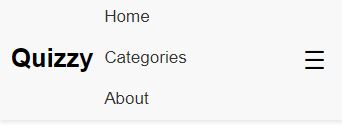

# Online Quiz App

Welcome to the Online Quiz App, an interactive platform for testing and improving knowledge in various fields. This app utilizes the Open Trivia Database (<https://opentdb.com/>) to provide a diverse range of quiz questions. Designed as a school project, it aims to offer an engaging user experience using standard web technologies: HTML, CSS, and JavaScript.

## Table of Contents

- [Online Quiz App](#online-quiz-app)
  - [Table of Contents](#table-of-contents)
  - [UX](#ux)
    - [User Goals](#user-goals)
    - [User Stories](#user-stories)
    - [Developer's Goals](#developers-goals)
- [Design Choices](#design-choices)
  - [Fonts](#fonts)
  - [Icons](#icons)
  - [Colors](#colors)
  - [Structure](#structure)
  - [Wireframes](#wireframes)
    - [Mobile Wireframe](#mobile-wireframe)
    - [Desktop Wireframe](#desktop-wireframe)
- [Features](#features)
  - [Existing Features](#existing-features)
      - [Desktop Header](#desktop-header)
      - [Mobile Header](#mobile-header)
      - [Navigation Menu](#navigation-menu)
  - [Planned Features](#planned-features)
- [Technologies Used](#technologies-used)
  - [Languages](#languages)
  - [Tools](#tools)
- [Testing](#testing)
  - [Functionality](#functionality)
  - [Usability](#usability)
  - [Accessibility](#accessibility)
- [Deployment](#deployment)
- [Credits](#credits)
  - [Acknowledgments](#acknowledgments)
  - [Resources](#resources)

[Back to Top](#table-of-contents)

## UX

### User Goals

- Access a wide range of quizzes to test and improve knowledge.
- Enjoy a user-friendly and engaging quiz experience.
- Participate in quizzes across various categories.

### User Stories

- **As a student**, I want to find interesting quizzes to learn and test my knowledge in different subjects.
- **As a teacher**, I seek an educational tool where I can engage my students with diverse quiz topics.
- **As a quiz enthusiast**, I want a platform to challenge myself and compare my scores with others.

### Developer's Goals

- Provide an educational and entertaining quiz platform.
- Ensure a smooth and responsive user experience.
- Integrate a variety of quiz categories and difficulty levels.

[Back to Top](#table-of-contents)

# Design Choices

## Fonts

- **Main Text: Arial** - A widely available, readable font for main content.
- **Headers: Helvetica** - A clean, modern font for headers and emphasis.

## Icons

- Simple and intuitive icons for navigation and interaction, sourced from [Font Awesome](https://fontawesome.com/).

## Colors

The color palette was chosen to be visually appealing and accessible to all users, ensuring high readability and an engaging user experience.

- **Primary Color (Blue)**: Used for headers, links, and to emphasize important elements. It provides a professional and calming tone.
  
- **Secondary Color (Green)**: Utilized for buttons, hover states, and interactive elements to denote action and progression.

- **Background (White)**: The main background color for content areas to ensure optimal readability and a clean, open feel.

- **Text Color (Dark Gray)**: A softer alternative to black, providing excellent readability without harsh contrast against the white background.

- **Accent Color (Light Blue)**: Highlights for selected categories and quiz options, adding a subtle visual cue for interactivity.

## Structure

A straightforward layout ensuring ease of navigation and optimal performance on all devices.

## Wireframes

The initial design phase of the Online Quiz App included the creation of wireframes to outline the app's layout and features. Using Figma, I started by designing the wireframe for the mobile version, ensuring a mobile-friendly user interface and a focus on usability. Once the mobile layout was finalized, I used it as a foundation to develop the wireframe for the desktop version, adapting the design to take advantage of the larger screen space.

These wireframes provide a visual representation of the app's structure and are crucial for understanding the user flow and interaction design. Both wireframes are included in the project repository and can be viewed through the links below:

### Mobile Wireframe

[View the Mobile Wireframe](docs/wireframe-Mobile.png)

This wireframe illustrates the mobile interface, highlighting the user's navigation path and interaction points within the app.

### Desktop Wireframe

[View the Desktop Wireframe](docs/wireframe-Desktop.png)

The desktop wireframe shows the layout and features as they will be arranged in the desktop environment, offering a broader view of the content and functionalities.

[Back to Top](#table-of-contents)

# Features

## Existing Features

- **Responsive Header**: A responsive header that adjusts to screen size for optimal user experience. It features the app's title and a profile icon, which is displayed on desktop views. On mobile views, a menu toggle is provided for navigation.

- **Interactive Navigation Menu**: A fully functional navigation menu that adapts to both desktop and mobile views. On desktop, the navigation items are displayed across the header, while on mobile, a hamburger menu icon reveals a dropdown menu for navigating the site. Smooth scrolling is implemented for a better user experience when navigating to different page sections.

- **Accessibility**: Initial steps have been taken to ensure the app is accessible, following WCAG guidelines. This includes semantic HTML, appropriate aria-labels, and keyboard-navigable components.

#### Desktop Header

#### Mobile Header

#### Navigation Menu

- **Desktop Navigation**: The navigation items are centered in the header for a balanced and aesthetic appearance.
- **Mobile Navigation**: The dropdown menu is easily accessible through the hamburger menu.

[Back to Top](#table-of-contents)

## Planned Features

- **Quiz Selection**: Users can choose from a variety of quiz categories and difficulty levels, sourced from the Open Trivia Database.
- **Real-Time Quiz Interaction**: Immediate feedback is provided on answers, enhancing the learning experience.
- **User Interface**: A clean and intuitive UI, ensuring ease of navigation for users of all ages.
- **Leaderboards**: A leaderboard system to add a competitive edge, encouraging users to improve their scores.
- **Social Sharing**: Integration of social media sharing options, enabling users to share their scores and challenge friends.
- **Accessibility Enhancements**: Continued improvements to ensure the app is accessible to users with disabilities, adhering to WCAG guidelines.

# Technologies Used

## Languages

- **HTML**: For structuring the web app.
- **CSS**: For styling the app.
- **JavaScript**: For interactive elements and API integration.

## Tools

- **Visual Studio Code**: As the code editor.
- **Git**: For version control.
- **GitHub**: For repository hosting.

# Testing

## Functionality

- Cross-browser testing to ensure compatibility.
- Mobile responsiveness testing.

## Usability

- User testing to assess the ease of navigation and understanding.

## Accessibility

- Adhering to WCAG guidelines for accessibility.

# Deployment

Instructions for deploying the app will be provided here.

# Credits

## Acknowledgments

- Thanks to Open Trivia Database for providing the quiz questions.
- Appreciation to teachers and students who will test the app.

## Resources

- [MDN Web Docs](https://developer.mozilla.org/) for development references.
- [CodeInstitute](http://www.codeinstitute.net/) for coding tutorials.

[Back to Top](#table-of-contents)
