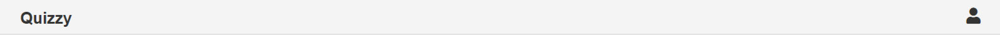
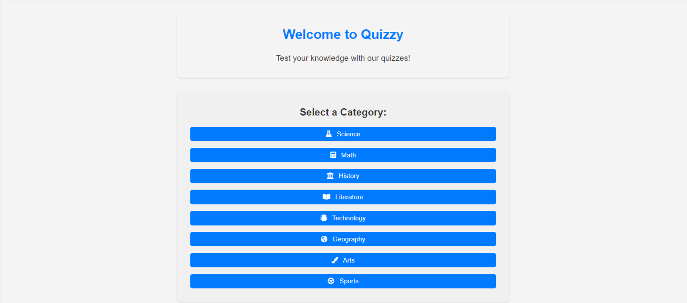
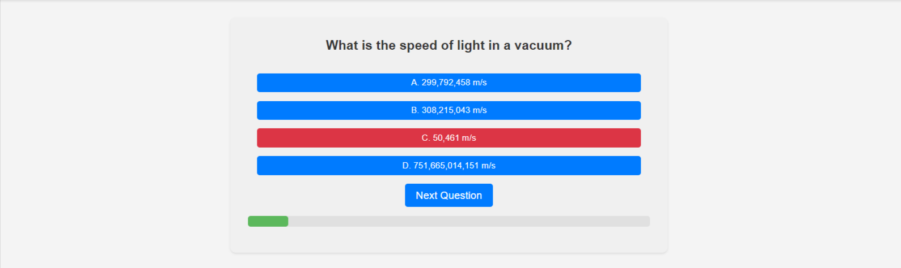

# Online Quiz App

The Online Quiz App is an interactive platform designed to provide users with a wide range of quizzes for knowledge testing and improvement. Leveraging the Open Trivia Database, this app is a school project that offers an engaging user experience with standard web technologies.

[Check out how Quizzy looks like here](https://yosephdev.github.io/quizzy/)

## Table of Contents

- [Online Quiz App](#online-quiz-app)
  - [Table of Contents](#table-of-contents)
  - [User Experience (UX)](#user-experience-ux)
    - [User Goals](#user-goals)
    - [User Stories](#user-stories)
    - [Developer's Goals](#developers-goals)
  - [Design](#design)
    - [Fonts](#fonts)
    - [Colors](#colors)
  - [Structure](#structure)
  - [Wireframes](#wireframes)
    - [Mobile Wireframe](#mobile-wireframe)
    - [Desktop Wireframe](#desktop-wireframe)
  - [Features](#features)
    - [Current Features](#current-features)
    - [Features to Be Implemented](#features-to-be-implemented)
- [Technologies Used](#technologies-used)
  - [Languages](#languages)
  - [Tools](#tools)
  - [Testing](#testing)
    - [Bugs Found and Fixed](#bugs-found-and-fixed)
    - [Manual Testing](#manual-testing)
  - [HTML](#html)
  - [CSS](#css)
    - [Lighthouse Report](#lighthouse-report)
  - [Reflections and Challenges Encountered](#reflections-and-challenges-encountered)
  - [Deployment](#deployment)
    - [GitHub Pages Deployment](#github-pages-deployment)
    - [Forking the GitHub Repository](#forking-the-github-repository)
    - [Local Clone](#local-clone)
  - [Credits](#credits)
    - [Content](#content)
    - [Media](#media)
    - [Acknowledgments](#acknowledgments)

[Back to Top](#table-of-contents)

## User Experience (UX)

### User Goals

- Access a wide range of quizzes to test and improve knowledge.
- Enjoy a user-friendly and engaging quiz experience.
- Participate in quizzes across various categories.

### User Stories

- **As a student**, I want to find interesting quizzes to learn and test my knowledge in different subjects.
- **As a teacher**, I seek an educational tool where I can engage my students with diverse quiz topics.
- **As a quiz enthusiast**, I want a platform to challenge myself and compare my scores with others.

### Developer's Goals

- Provide an educational and entertaining quiz platform.
- Ensure a smooth and responsive user experience.
- Integrate a variety of quiz categories and difficulty levels.

## Design

### Fonts

- **Main Text**: Arial
- **Headers**: Helvetica

### Colors

- **Primary (Blue)**: Used for headers and important elements.
- **Secondary (Green)**: For interactive elements like buttons.
- **Background (White)**: Main content areas.
- **Text (Dark Gray)**: Main body text.

## Structure

A straightforward layout ensuring ease of navigation and optimal performance on all devices.

## Wireframes

The initial design phase of the Online Quiz App included the creation of wireframes to outline the app's layout and features. Using Figma, I started by designing the wireframe for the mobile version, ensuring a mobile-friendly user interface and a focus on usability. Once the mobile layout was finalized, I used it as a foundation to develop the wireframe for the desktop version, adapting the design to take advantage of the larger screen space.

These wireframes provide a visual representation of the app's structure and are crucial for understanding the user flow and interaction design. Both wireframes are included in the project repository and can be viewed through the links below:

### Mobile Wireframe

[View the Mobile Wireframe](docs/wireframe-Mobile.png)

This wireframe illustrates the mobile interface, highlighting the user's navigation path and interaction points within the app.

### Desktop Wireframe

[View the Desktop Wireframe](docs/wireframe-Desktop.png)

The desktop wireframe shows the layout and features as they will be arranged in the desktop environment, offering a broader view of the content and functionalities.

[Back to Top](#table-of-contents)

## Features

### Current Features

- **Header**: Showcasing the app's name and navigational cues.
  

- **Category Selection**: Users can select from various quiz categories, making the quiz experience diverse and customizable.
    
  
- **Dynamic Quiz Interface**: The quiz adapts based on the selected category, with a smooth transition between questions.
  
  
- **Instant Feedback Mechanism**: Users receive immediate feedback on their answers, enhancing the interactive experience.
  
  
- **Score Tracking**: The app accurately tracks and displays the user's score throughout the quiz.
- 

### Features to Be Implemented

- **Leaderboards**: To introduce a competitive edge and motivate users to improve.
- **Social Sharing**: Enabling users to share scores and challenge friends, thereby increasing the app's reach.
- **User Accounts**: Intend to allow users to create accounts to save their progress and scores.

# Technologies Used

## Languages

- [HTML](https://en.wikipedia.org/wiki/HTML "HTML") - For structuring the web app.
- [CSS](https://en.wikipedia.org/wiki/CSS "CSS") - For styling the app.
- [JavaScript](https://en.wikipedia.org/wiki/JavaScript "JavaScript") - For interactive elements and API integration.

## Tools

- **Visual Studio Code**: As the code editor.
- **Git**: For version control.
- **GitHub**: For repository hosting.
- [W3C HTML Validation Service](https://validator.w3.org/ "W3C HTML") - For validating HTML content.
- [W3C CSS Validation Service](https://jigsaw.w3.org/css-validator/ "W3C CSS") - For validating CSS styles.
- [JSHint JavaScript Validator](https://jshint.com/ "JavaScript Validator") - For validating JavaScript codes.

## Testing

Testing has been a critical part of developing the Online Quiz App to ensure functionality, usability, and compatibility across different browsers and devices.

- I tested playing the game in different browsers: Chrome, Firefox, Safari.
- I confirmed that the game results are always correct.
- I confirmed that the header, instructions, options, results, and footer text are all readable and easy to understand.
- I confirmed that the colors and fonts chosen are easy to read and accessible by running it through Lighthouse in DevTools.

### Bugs Found and Fixed

- **Solved Bugs**: 
  - When deployed to GitHub Pages, some links were broken due to path issues. Fixed by updating the file paths.
  - The CSS file link was corrected by removing the leading slash.

- **Unsolved Bugs**: 
  - There are currently no unsolved bugs.

### Manual Testing

Manual testing was performed extensively to ensure all features worked as expected. This involved:

- **Navigation and Responsiveness**: Testing involved checking the navigation menu, category selection, and the responsiveness of the layout on various devices and screen sizes.

- **Quiz Functionality**: The start process of the quiz, question display mechanics, answer selection, and progression through the quiz were verified for consistency and accuracy.

- **Score Tracking and Results Display**: The score tracking mechanism and the correct display of results at the end of the quiz were tested to ensure accurate feedback to the user.

- **User Interface Interactions**: All buttons and links were tested to ensure they functioned correctly and provided the expected outcomes, enhancing the overall user experience.

## HTML

- No errors were returned when passing through the official W3C validator.

## CSS

- No errors were found when passing through the official (Jigsaw) validator.

### Lighthouse Report

Accessibility and performance were tested using the Lighthouse tool in Chrome DevTools, and the app scored high in all categories.

## Reflections and Challenges Encountered

During development, I encountered challenges such as ensuring cross-browser compatibility and maintaining a responsive design. I learned the importance of thorough testing and incremental development.

## Deployment

The Online Quiz App is hosted on GitHub Pages. To deploy the app and work on it locally, follow these steps:

### GitHub Pages Deployment

1. Log in to GitHub and locate the GitHub repository for the Online Quiz App.

2. At the top of the repository (not the main navigation), find the "Settings" button in the menu.

3. Scroll down the Settings page until you locate the "GitHub Pages" section.

4. Under "Source," click the dropdown menu that says "None" and select the "Main" branch, then click "Save."

5. The page will automatically refresh.

6. Scroll back down to locate the now-published site link in the "GitHub Pages" section. You can access the live site at [https://yosephdev.github.io/quizzy/](https://yosephdev.github.io/quizzy/).

### Forking the GitHub Repository

By forking the repository, you can create a copy of the original repository on your GitHub account to view and make changes without affecting the original repository. Follow these steps:

1. Log in to GitHub and locate the GitHub repository for the Online Quiz App.

2. At the top of the repository (under the main navigation), find the "Fork" button.

3. Click the "Fork" button to create a copy of the original repository in your GitHub account.

### Local Clone

To work on the Online Quiz App locally, you can clone the GitHub repository to your computer using these steps:

1. Log in to GitHub and locate the GitHub repository for the Online Quiz App.

2. Under the repository name, click "Clone or download."

3. Click on the code button and select "clone with HTTPS," "SSH," or "GitHub CLI," then copy the link shown.

4. Open Git Bash or your preferred terminal.

5. Change the current working directory to the location where you want the cloned directory to be created.

6. Type `git clone` followed by the URL you copied in step 3.

7. Press Enter, and your local clone will be created.

Now you can deploy the app on GitHub Pages and work on it locally.

## Credits

### Content

- Questions sourced from [Open Trivia Database](<https://opentdb.com/>).

### Media

- [FontAwesome](https://fontawesome.com/) for app icons.

### Acknowledgments

- [Simen Daehlin](https://github.com/Eventyret) for help with project ideas and tips.
- [Mitko Bachvarov](https://www.linkedin.com/in/mitko-bachvarov-40b50776/) for project guidance and feedback.
- Thanks to all contributors and testers who have helped improve the app.

[Back to Top](#online-quiz-app)
